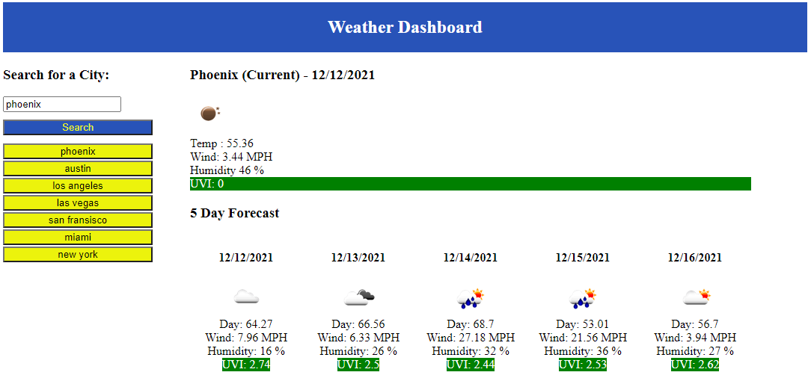

  
# Weather Dashboard

## Description
This repository contains the code that generates the weahter dashboard. After entering a desired major city, the user can see the current weather conditions and the 5 day forecast. Additionally, the depdning on the UV index range, the background will change color accordingly; Green = low, yellow = mild, red = high. 

## App

The weather dashboard can be found here [here](https://nnavarr.github.io/weather-dashboard/).

## Usage
To use the dashboard, simply enter a major city within the textbox. Once entered click the 'Search' button. Finally, the user can refresh the page to see a list of previously searched cities. Should the user want to reload those cities, they can simply click the city's button. 